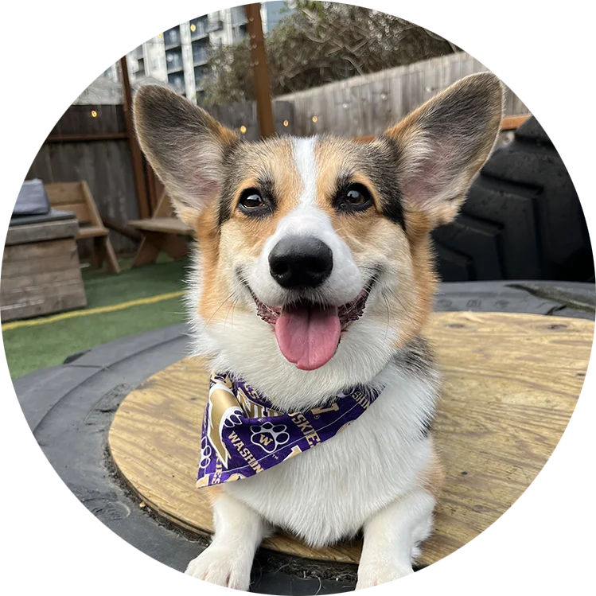

 
 

# Stephen Wong

 

Hey there, I'm Stephen, a software engineer with a knack for building cool stuff. From design to web apps, I'm all about finding clever solutions to tough problems.

When I'm not coding, I hang out with my trusty corgi, Num Num. He's my go-to when it comes to debugging code (you know, the old rubber duck trick?). He may not be as good at coding as I am, but he's a great listener!

 

 
    

I can't put down my computer because I enjoy learing a little bit of something every day.

<body>
