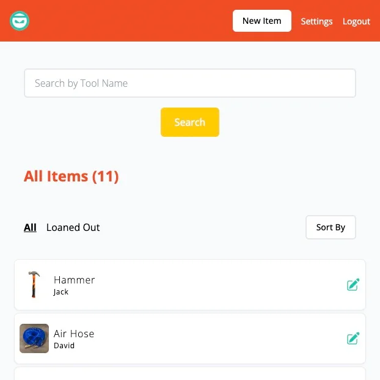
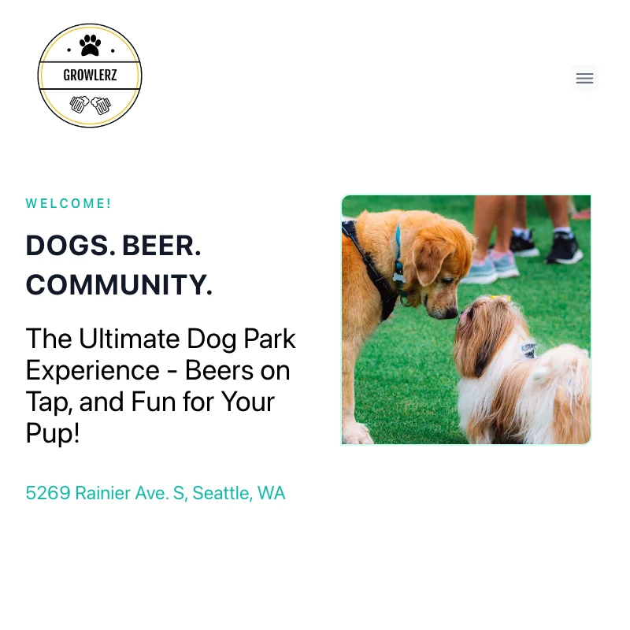
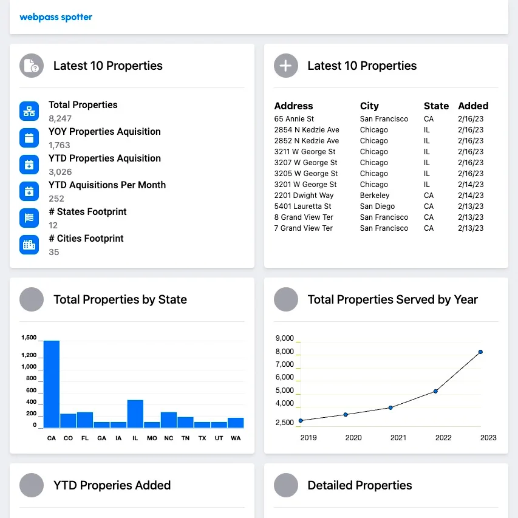
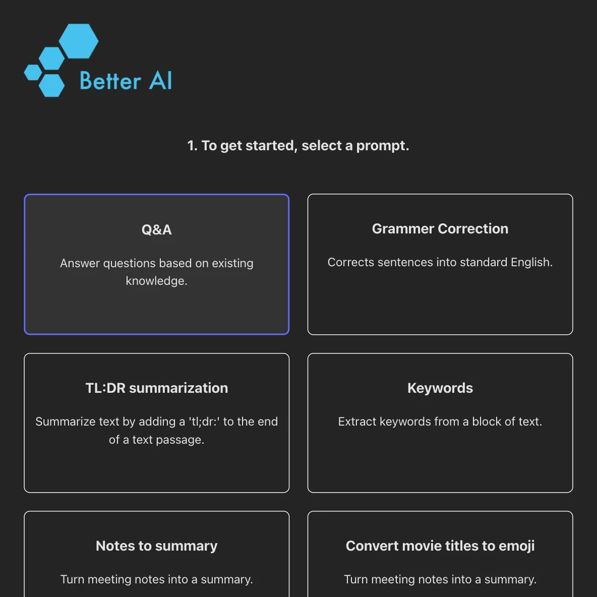
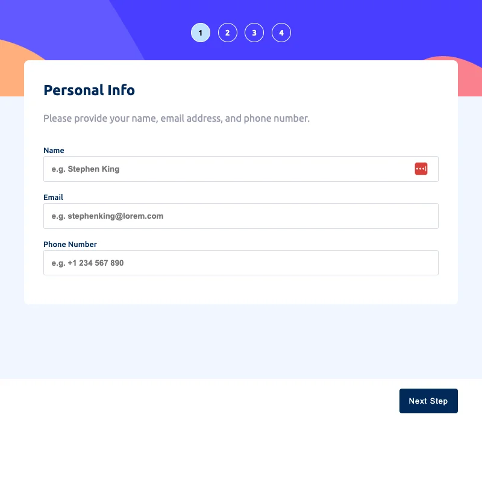
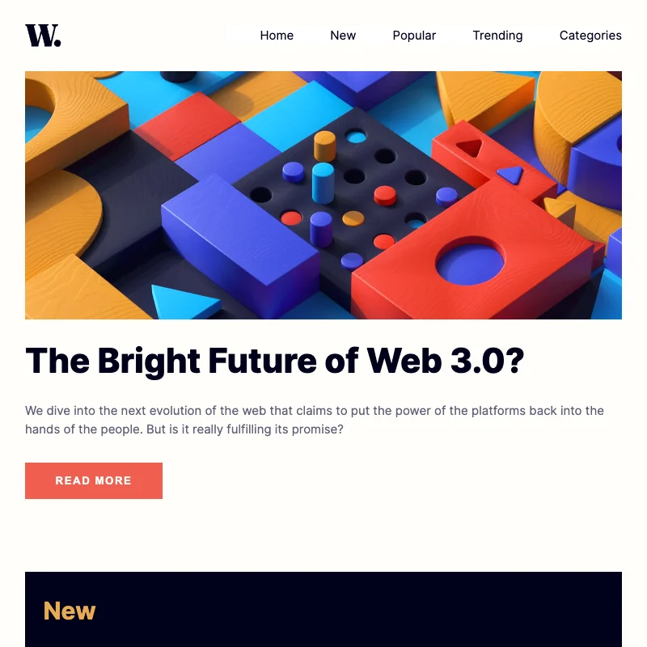
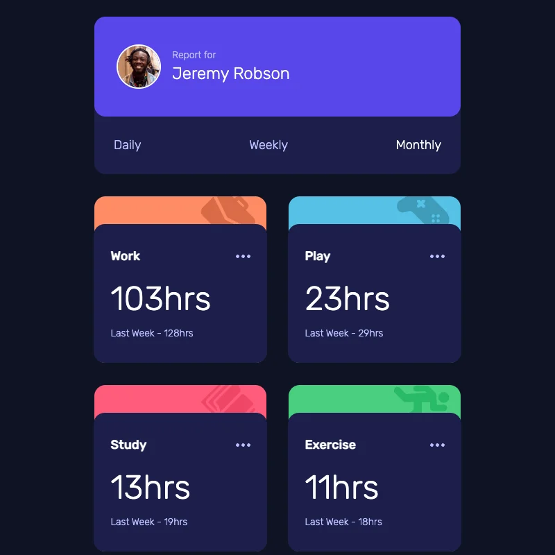
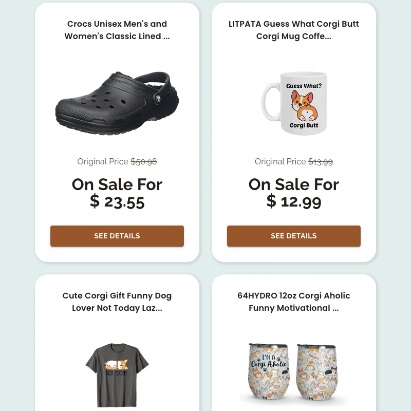
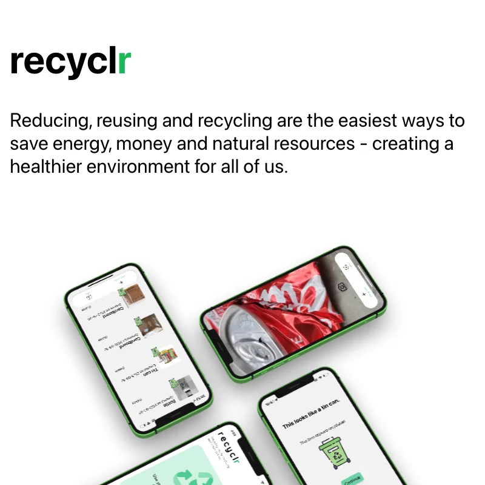
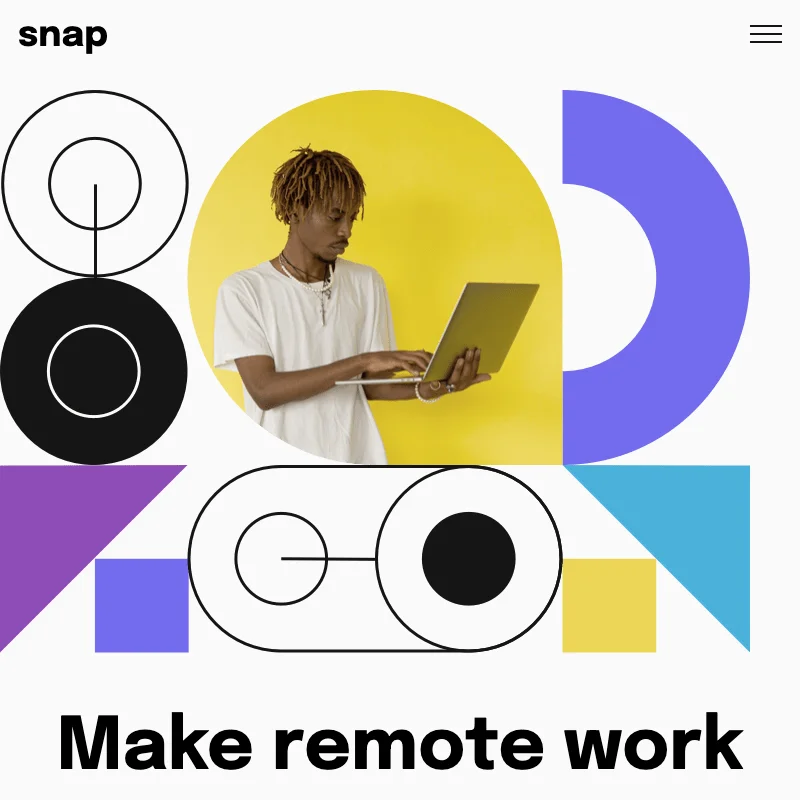

 
 

# Stephen Wong

 

Hey there, I'm Stephen, a software engineer with a knack for building cool stuff. From design to web apps, I'm all about finding clever solutions to tough problems.

Don't forget to visit my <a href="https://www.wongstephenk.com" aria-label="Stephen Wong's website" >website</a> to get the full scoop.

When I'm not coding, I hang out with my trusty corgi, Num Num. He's my go-to when it comes to debugging code (you know, the old rubber duck trick?). He may not be as good at coding as I am, but he's a great listener!

 

 
    

 

Take a look at my GitHub repos if you want to see what I've been up to lately. And if you're up for a chat about all things software dev, hit me up!
 
 

---

 

## Projects

<table border=1>
<tr valign="top">
<td width="50%" >
<h2>BorrowNinja</h2>

<strong>JavaScript, React, Tailwind, Node.js, Express.js, MongoDb - </strong> BorrowNinja offers a user-friendly system to track your tools and monitor borrowing and returning. Stay organized and avoid losing or misplacing your tools.

<strong>Demo Login:</strong> demo@borrowninja.com 
<strong>Demo Password:</strong> password

 

</td>

<td width="50%" >
<h2>Growlerz Seattle</h2>

<strong>JavaScript, React, Tailwind, GraphQL, Strapi CMs, PostgreSQL - </strong> The Growlerz dog park website utilizes a headless CMS, allowing for effortless updates to business information by the client. Visitors can easily access the necessary information on the website.

 

</td>
</tr>

<tr valign="top">
<td width="50%" >
<h2>WebpassWatch</h2>

<strong>JavaScript, React, Chart.js, Node.js, Express.js - </strong> WebpassWatch is a dashboard app that extracts internet availability information for properties from Webpass.net's website and presents it in a clear and informative format. With its user-friendly interface, WebpassWatch makes it easy to access this valuable data and stay informed.

 

</td>

<td width="50%" >
<h2>Better AI</h2>

<strong>JavaScript, React, Tailwind,  RESTful API - </strong> Better AI is a user-friendly app powered by ChatGPT, designed to produce accurate and coherent responses to your prompts. Whether you're a writer or a marketer, our innovative technology streamlines your writing process and enhances your communication.

 

</td>
</tr>
</table>

## Other Components or Small Projects

<table border=1 width=100% valign=top>
<tr>
<td width=33%>
    <h3>Multi-step Form</h3></td>
<td width=33%>
    <h3>Newspaper Layout</h3></td>
<td width=33%>
    <h3>Time Tracker</h3></td>
</tr>
<tr>
<td width=33%>
    <h3>Jupiter Deals</h3></td>
<td width=33%>
    <h3>Recyclr iOS App</h3></td>
<td width=33%>
    <h3>Landing Page</h3></td>
</tr>
</table>

## Technologies

Here are some of the technologies I have worked with (but not limited to):

	

<!-- Where these came from https://marwin1991.github.io/profile-technology-icons/ -->

 

## My stats

I can't put down my computer because I enjoy learing a little bit of something every day.

<body>
